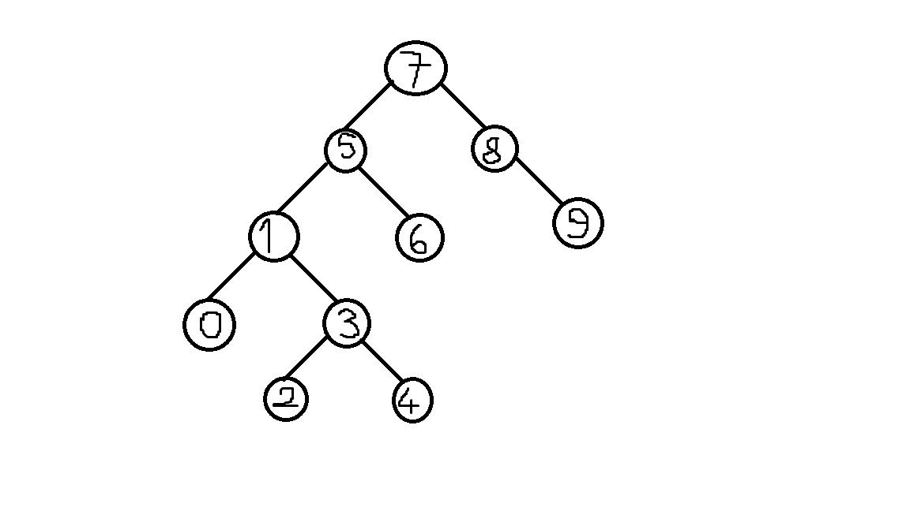

# Proje 1
### [22,27,16,2,18,6] -> Insertion Sort

- [22,27,16,2,18,6]
- [22,16,27,2,18,6]
- [22,16,2,27,18,6]
- [22,16,2,18,27,6]
- [22,16,2,18,6,27]
- [16,22,2,18,6,27]
- [16,2,22,18,6,27]
- [16,2,18,22,6,27]
- [16,2,18,6,22,27]
- [2,16,18,6,22,27]
- [2,16,6,18,22,27]
- [2,6,16,18,22,27]

### Big-O
O(n^2)

### [7,3,5,8,2,9,4,15,6] dizisinin Selection Sort'a göre ilk 4 adımını yazınız.

- [2,3,5,8,7,9,4,15,6]
- [2,3,4,8,7,9,5,15,6]
- [2,3,4,5,7,9,8,15,6]
- [2,3,4,5,6,9,8,15,7]

# Proje 2
### [16,21,11,8,12,22] -> Merge Sort

- [16,21,11] - [8,12,22]
- ([16,21] - [11]) - ([8,12] [22])
- (([16] [21]) - [11]) - (([8] [12]) - [22])
- (([16,21]) - [11]) - (([8,12]) - [22])
- [11,16,21] - [8,12,22]
- [8,11,12,16,21,22]

# Proje 3
### [7, 5, 1, 8, 3, 6, 0, 9, 4, 2] dizisinin Binary-Search-Tree aşamalarını yazınız.
